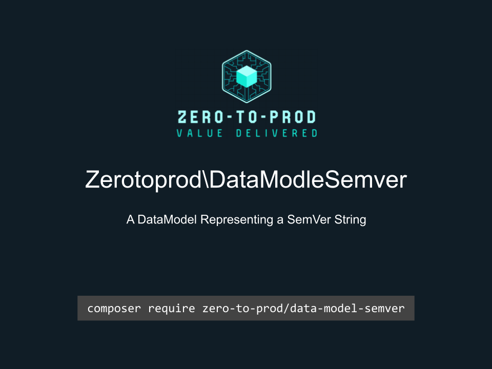

# Zerotoprod\DataModelSemver



[](https://github.com/zero-to-prod/data-model-semver)
[](https://github.com/zero-to-prod/data-model-semver/actions)
[](https://packagist.org/packages/zero-to-prod/data-model-semver/stats)
[](https://packagist.org/packages/zero-to-prod/data-model-semver/stats)
[](https://packagist.org/packages/zero-to-prod/data-model-semver)
[](https://github.com/zero-to-prod/data-model-semver/blob/main/LICENSE.md)

A `DataModel` representing the components of a SemVer string.

## Installation

Install the package via Composer:

```bash
composer require zero-to-prod/data-model-semver
```

## Usage

Pass a [SemVer](https://semver.org/) string to the `from()` method.

```php
$Semver = \Zerotoprod\DataModelSemver\Semver::from('1.2.3-prerelease+meta');

echo $Semver->major; // 1
echo $Semver->minor; // 2
echo $Semver->patch; // 3
echo $Semver->prerelease; // prerelease
echo $Semver->buildmetadata; //meta
```

### Helper Methods
```php
Semver::from('1.2.3-prerelease+meta')->toArray();
Semver::from('1.2.3-prerelease+meta')->toJson();
```