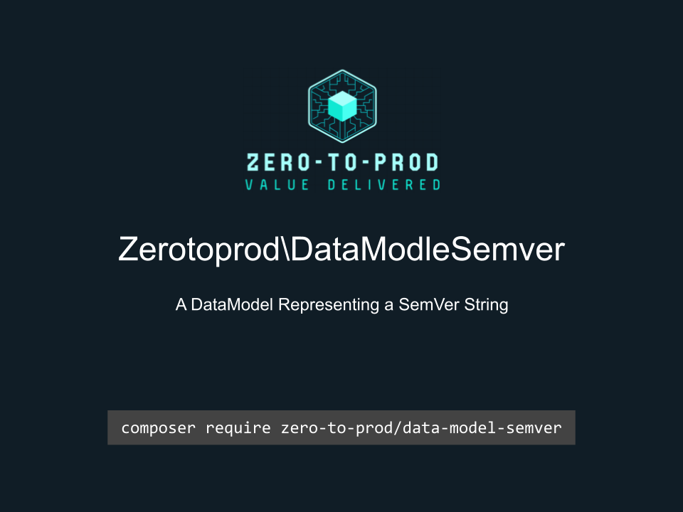

# Zerotoprod\DataModelSemver



[](https://github.com/zero-to-prod/data-model-semver)
[](https://github.com/zero-to-prod/data-model-semver/actions)
[](https://packagist.org/packages/zero-to-prod/data-model-semver/stats)
[](https://packagist.org/packages/zero-to-prod/data-model-semver/stats)
[](https://packagist.org/packages/zero-to-prod/data-model-semver)
[](https://github.com/zero-to-prod/data-model-semver/blob/main/LICENSE.md)
[](https://wakatime.com/badge/github/zero-to-prod/data-model-semver)
[](https://hitsofcode.com/github/zero-to-prod/data-model-semver/view?branch=main)

## Contents

- [Introduction](#introduction)
- [Requirements](#requirements)
- [Installation](#installation)
- [Usage](#usage)
  - [Helper Methods](#helper-methods)
- [Publishing DataModels](#publishing-datamodels)
- [Local Development](./LOCAL_DEVELOPMENT.md)
- [Contributing](#contributing)

## Introduction

A `DataModel` representing the components of a SemVer string.

## Requirements

- PHP 7.1 or higher.

## Installation

Install `Zerotoprod\DynamicSetter` via [Composer](https://getcomposer.org/):

```bash
composer require zero-to-prod/data-model-semver
```

This will add the package to your project’s dependencies and create an autoloader entry for it.

## Usage

Pass a [SemVer](https://semver.org/) string to the `from()` method.

```php
$Semver = \Zerotoprod\DataModelSemver\Semver::from('1.2.3-prerelease+meta');

echo $Semver->major; // 1
echo $Semver->minor; // 2
echo $Semver->patch; // 3
echo $Semver->prerelease; // prerelease
echo $Semver->buildmetadata; //meta
```

### Helper Methods

```php
Semver::from('1.2.3-prerelease+meta')->toArray();
Semver::from('1.2.3-prerelease+meta')->toJson();
```

## Publishing DataModels

You can directly import these files into your project like this:

```shell
./vendor/bin/data-model-envoyer app/DataModels
```

The first argument is the destination of where the files are copied to.


## Contributing

Contributions, issues, and feature requests are welcome!
Feel free to check the [issues](https://github.com/zero-to-prod/data-model-semver/issues) page if you want to contribute.

1. Fork the repository.
2. Create a new branch (`git checkout -b feature-branch`).
3. Commit changes (`git commit -m 'Add some feature'`).
4. Push to the branch (`git push origin feature-branch`).
5. Create a new Pull Request.